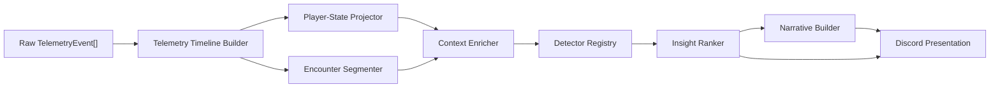

# Telemetry Coaching Timeline Design

**Status:** Approved
**Date:** 2026-07-25

## Summary

Replace repeated, feature-specific interpretation of raw PUBG telemetry with one normalized match
timeline. Project player state and segment encounters once, enrich those encounters with team and
match context, then run isolated coaching detectors over the resulting evidence.

The system serves three outcomes:

1. Prevent false coaching by modelling what each player could physically do.
2. Produce deeper, evidence-backed tactical coaching.
3. Build a concise match narrative from proven event relationships.

Processing every available event is not a goal. An event type is incorporated only when it supports
a defined state transition, detector, confidence decision, or narrative relationship.

## Problem

The current coaching path builds fight context directly from selected raw event arrays. This allows
one event to be interpreted without all relevant lifecycle context. For example, damage that knocked
a player was treated as the beginning of an eight-second reset window even though the player remained
DBNO until death.

Adding more event arrays directly to the fight-context builder would repeat this failure mode:

- state would be reconstructed differently by different features;
- damage from separate encounters could leak across boundaries;
- absence of an event could be mistaken for evidence;
- the builder and decision engine would grow together into one difficult-to-test module; and
- match narration could contradict tactical coaching.

## Goals

- Create one deterministic, chronological representation of a match.
- Model alive, knocked, carried, revived, dead, redeployed, disconnected, healing, swimming, and
  in-vehicle states.
- Keep damage and decisions inside the encounter in which they occurred.
- Make every coaching claim traceable to exact telemetry evidence.
- Suppress claims when required evidence is absent or ambiguous.
- Rank a small number of high-confidence, actionable insights.
- Keep LLM narration constrained to supplied claims.
- Preserve normal Discord match delivery when coaching fails.
- Produce identical derived results from live and cached raw telemetry.

## Non-goals

- Processing every telemetry event merely because it exists.
- Inferring line of sight, cover, intent, inventory, or terrain without supporting telemetry.
- Treating missing events as proof unless observability for that event is established.
- Persisting the derived timeline in the first implementation.
- Maintaining the current and new coaching architectures permanently.
- Adding dependencies or a database migration for the initial rollout.

## Decision

Use a normalized-timeline architecture. This was selected over:

1. **Vertical detector features:** faster visible delivery, but each feature would rebuild overlapping
   state and could produce contradictory answers.
2. **Extending the current fight-context builder:** smallest immediate diff, but unsuitable for a
   complete lifecycle, encounter isolation, and match narrative.

The timeline foundation costs more up front but gives every downstream consumer the same account of
what happened.

## Prerequisites

- Monitored players and `MatchAnalysis.playerAnalyses` must expose stable PUBG account IDs. If the
  roster-identity work has not landed when implementation begins, that migration is the first task
  of Phase 1.
- Official telemetry events that are missing from the installed `@j03fr0st/pubg-ts` types, including
  redeploy events, must be added or corrected in `pubg-ts` before this bot treats them as typed
  domain input. The bot must not accumulate permanent casts or a competing local PUBG event schema.

## Architecture



### Telemetry timeline builder

The builder accepts the complete raw telemetry stream and match start time. It validates timestamps,
normalizes supported event types, attaches stable actor identities, and sorts events
deterministically.

Each normalized event contains:

- source event type and timestamp;
- match-relative time;
- actor and target account IDs and names where available;
- event-specific normalized data;
- a reference or compact copy of the source evidence; and
- normalization confidence or diagnostics.

Account ID is authoritative. Name matching is allowed only when one side lacks an account ID and must
lower confidence. Two different account IDs are never treated as the same actor because their names
match.

Unknown event types are retained as generic timeline records or ignored with diagnostics. They never
fail the match summary. Generic records are not eligible for coaching evidence until their schema is
supported by `pubg-ts`.

### Player-state projector

The projector consumes normalized lifecycle and movement events and emits non-overlapping state
intervals for each monitored player.

Core lifecycle transitions:

```text
alive -> knocked -> revived -> alive
alive -> knocked -> carried -> knocked
alive -> knocked -> dead
alive -> dead
dead -> redeployed -> alive
alive/knocked -> disconnected -> reconnected or dead
```

Healing, swimming, and in-vehicle are concurrent activity states rather than replacements for the
core lifecycle.

State invariants:

- knocked, carried, dead, and disconnected time cannot count as a heal, reposition, or trade window;
- damage before the latest revive or redeploy cannot seed a later encounter;
- a revive restores actionability only from the revive event onward;
- a second knock closes any post-revive action window;
- ambiguous transitions lower state confidence instead of inventing a transition.

### Encounter segmenter

The segmenter groups attacks, damage, knocks, armor breaks, utility, and decisive events into
independent encounters.

Boundaries use:

- monitored player and opponent identity;
- elapsed time;
- lifecycle changes;
- meaningful separation in position;
- completed recovery;
- vehicle transitions;
- redeploy; and
- a decisive end such as knock, death, or disengagement.

Timing thresholds are centralized configuration owned by the segmentation/detection domain. A
detector cannot silently introduce a different definition of the same encounter.

### Context enricher

The enricher joins encounter evidence with:

- teammate positions, attacks, damage, knocks, and revives;
- zone phase, blue-zone damage, and alive-player count;
- movement and exposure;
- armor destruction;
- known item possession and utility use;
- vehicle entry, exit, damage, wheel loss, and destruction; and
- carry, disconnect, and redeploy state.

Derived facts record their input evidence and confidence. Geometry based on sparse positions is
labelled accordingly and is not described as line of sight.

### Detector registry

Each detector is an isolated, side-effect-free module. It receives an enriched encounter or match
timeline and returns one of:

```text
candidate: supported claim, evidence, confidence, severity, recommendation
suppressed: stable reason and missing or conflicting evidence
not-applicable: the detector's scenario did not occur
```

One detector failure is isolated and does not stop other detectors or Discord presentation.

## Detectors

| Detector | Required evidence | Important suppression conditions |
| --- | --- | --- |
| Lifecycle accuracy | Knock, revive, carry, death, redeploy, and login/logout order | Missing or contradictory lifecycle events |
| Failed reset / re-peek | Material damage while actionable, usable recovery time, no completed reset, same opponent or exposure | DBNO, carried, dead, disconnected, insufficient time, completed heal, encounter boundary |
| Team spacing / failed trade | Synchronized player positions plus teammate attack or damage timing | Sparse positions, teammate down/dead, different opponent, unknown identity |
| Damage conversion | Damage taken/dealt, attacks, shots, and outcome inside one encounter | Cross-encounter evidence, environmental damage, incomplete combat evidence |
| Movement / exposure | Periodic positions and repeated combat exposure | Sparse samples, DBNO movement, swimming/carry state, uncertain units |
| Recovery / revive decisions | Heal/revive timing, lifecycle state, nearby enemy pressure | No evidence of pressure, interrupted action not distinguishable, teammate state unknown |
| Zone / rotation pressure | Zone phase, positions, blue-zone damage, vehicle state | Unknown phase or position, forced state not distinguishable |
| Armor disadvantage | Armor destruction followed by encounter evidence | Destroyed item unknown, unrelated later fight |
| Utility usage | Known possession, drop/use/throw events, encounter timing | Inventory cannot be established, utility transferred or dropped |
| Vehicle decisions | Ride/leave/damage/wheel/destroy events plus immediate encounter | Vehicle identity or player occupancy ambiguous |
| Match narrative | Ranked detector results and established timeline relationships | Relationship is merely chronological rather than supported |

The lifecycle detector is primarily a guardrail and diagnostic source. It does not need to emit a
user-facing mistake.

## Confidence and evidence policy

- Every user-facing statement maps to exact normalized events or derived facts with cited inputs.
- Absence is evidence only when the relevant event is known to be observable for that interval.
- Unsupported claims are suppressed, not downgraded into vague language.
- Low-confidence geometry cannot produce high-confidence tactical advice.
- Severity never compensates for weak evidence.
- Unknown or malformed telemetry lowers confidence locally; it does not invalidate unrelated facts.
- Raw telemetry and provider/model output are untrusted inputs.

Suppression reasons are debug diagnostics. They are not included in Discord output.

## Ranking and narration

The ranker scores supported candidates by:

1. confidence;
2. severity;
3. actionability;
4. causal proximity to the decisive outcome; and
5. novelty relative to already selected insights.

Overlapping candidates are merged or deduplicated. Output remains capped to the strongest few
insights per player.

The narrative builder links only relationships already established by detectors. For example:

```text
late rotation -> blue-zone damage -> exposed dismount -> isolated fight -> knock
```

Chronological adjacency alone does not establish causality.

Deterministic narration is the trusted fallback. An LLM may rephrase supplied facts and actions but
cannot introduce new names, numbers, weapons, terrain, motives, or recommendations.

## Integration and migration

- `TelemetryProcessorService` continues producing current match statistics.
- `MatchPresentationService` passes the complete raw telemetry input into coaching without
  feature-specific filtering.
- The new timeline pipeline initially runs in shadow mode beside current coaching.
- `FightContextBuilderService` becomes a temporary adapter over normalized encounters where needed.
- After fixture and shadow parity, consumers move to enriched encounters and the adapter is removed.
- Permanent compatibility overloads or dual pipelines are not retained.
- Derived timelines are rebuilt from the already cached raw telemetry. Persistence is deferred until
  profiling proves it necessary.
- Coaching analysis and narration remain best-effort; normal match embeds are always deliverable.

This design supersedes the single-file ownership proposed by
`docs/mithril/plans/2026-07-17-coaching-insight-deepening.md` where the documents conflict. It retains
that plan's account-ID-first identity, complete raw-telemetry input, evidence-backed claims, and
presentation resilience, but assigns normalization, state projection, segmentation, and detection to
separate modules.

## Delivery

### Phase 1: Trustworthy timeline

- Implement normalization, player-state projection, and encounter segmentation.
- Add lifecycle support for knock, carry, revive, death, redeploy, and disconnect.
- Run the new timeline in shadow mode.

Exit criteria:

- knock-to-death time never becomes a reset window;
- pre-revive or pre-redeploy damage cannot leak forward;
- cached and live telemetry produce identical timelines;
- malformed and unknown events are nonfatal; and
- existing match delivery remains unchanged.

### Phase 2: Core fight coaching

- Failed reset / re-peek
- Team spacing / failed trade
- Damage conversion
- Movement / exposure
- Recovery / revive decisions

Each detector must have positive, negative, and suppression fixtures before becoming visible.

### Phase 3: Match-context coaching

- Zone / rotation pressure
- Armor disadvantage
- Utility usage
- Vehicle decisions
- Carry and redeploy context

A detector remains disabled until its required fields are confirmed against representative real
telemetry.

### Phase 4: Ranking and narrative

- Deduplicate overlapping candidates.
- Rank by confidence, severity, actionability, and causal proximity.
- Link supported event relationships.
- Preserve deterministic fallback narration.
- Permit LLM rephrasing only through the existing evidence guardrail.

## Verification strategy

- Table-driven tests cover every supported player-state transition.
- Equal, missing, and out-of-order timestamps have deterministic tests.
- Encounter tests prove that damage and recovery do not cross boundaries.
- Every detector has candidate, not-applicable, and suppression contract tests.
- Anonymized real fixtures cover knock/revive, carry, redeploy, disconnect, vehicles, zones, armor,
  utility, and sparse positions.
- Cached-versus-live parity is tested at the coaching public seam.
- End-to-end Discord tests prove that coaching failures preserve ordinary match embeds.
- Golden narration tests assert concise, evidence-backed output.
- Every reported false insight becomes a permanent regression fixture, beginning with the
  100-damage knock followed by death without a revive.
- Shadow-mode comparisons report differences without changing user-visible output.

## Completion criteria

- All supported lifecycle transitions are deterministic and fixture-backed.
- Detectors cannot use evidence outside their encounter.
- Every visible claim exposes evidence and confidence.
- All known false-positive fixtures are suppressed.
- Unknown events and individual detector failures are nonfatal.
- Live and cached inputs produce the same coaching result.
- Normal Discord match delivery is independent of coaching success.
- The temporary compatibility path is removed after parity.

## Sources

- [PUBG Telemetry](https://documentation.pubg.com/en/telemetry.html)
- [PUBG Telemetry Events](https://documentation.pubg.com/en/telemetry-events.html)
- Installed SDK contract:
  `node_modules/@j03fr0st/pubg-ts/dist/types/telemetry.d.ts` (`@j03fr0st/pubg-ts` 2.0.0)
