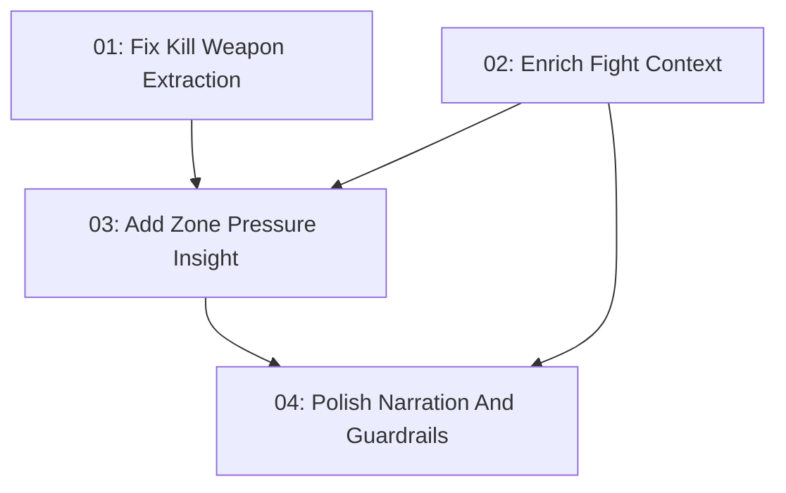

# Telemetry-Backed Coaching Enhancements

## Overview

Improve the PUBG match coach by fixing real `LogPlayerKillV2` weapon extraction, enriching decisive fight context, and adding conservative zone-pressure coaching. The feature keeps tactical interpretation deterministic and leaves the LLM as a guarded narrator only.

## Quick Links

- [Requirements](./requirements.md) — full requirements and acceptance criteria
- [Design](../../design/2026-06-02-telemetry-backed-coaching-enhancements/design.md) — approved solution shape and decisions
- [Action Required](./action-required.md) — manual steps needing human action
- [Manifest](./spec.json) — machine-readable orchestration contract
- [Implementation Log](./implementation-log.md) — append-only execution and review record

## Dependency Graph

## Waves

| Wave | Tasks | Description |
|------|-------|-------------|
| 1 | task-01, task-02 | Correct telemetry extraction and enrich fight-context facts in parallel. |
| 2 | task-03 | Add zone-pressure decision logic from enriched fight context. |
| 3 | task-04 | Make narration and guardrails use the richer evidence cleanly. |

## Task Status

### Wave 1

- [x] [task-01-kill-weapon-extraction](./tasks/task-01-kill-weapon-extraction.md) — Fix Kill Weapon Extraction
- [x] [task-02-fight-context-enrichment](./tasks/task-02-fight-context-enrichment.md) — Enrich Fight Context

### Wave 2

- [x] [task-03-zone-pressure-insight](./tasks/task-03-zone-pressure-insight.md) — Add Zone Pressure Insight

### Wave 3

- [x] [task-04-narration-and-guardrails](./tasks/task-04-narration-and-guardrails.md) — Polish Narration And Guardrails
