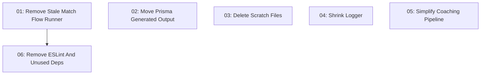

# Repo Simplification

## Overview

Reduce repo maintenance surface by deleting stale scripts and scratch files, moving generated Prisma output out of handwritten source, removing duplicate tooling and unused dependencies, and shrinking two small abstractions without changing bot behavior.

## Quick Links

- [Requirements](./requirements.md) - full requirements and acceptance criteria
- [Design](../../design/2026-06-17-repo-simplification/design.md) - approved solution shape and decisions
- [Action Required](./action-required.md) - manual steps needing human action
- [Manifest](./spec.json) - machine-readable orchestration contract
- [Implementation Log](./implementation-log.md) - append-only execution and review record

## Dependency Graph

## Waves

| Wave | Tasks | Description |
|------|-------|-------------|
| 1 | task-01, task-02, task-03, task-04, task-05 | Independent cleanup that touches non-overlapping source, script, generated-output, scratch, logger, and pipeline files. |
| 2 | task-06 | Package/tooling cleanup after stale script references are removed. |

## Task Status

### Wave 1

- [x] [task-01-remove-stale-match-flow-runner](./tasks/task-01-remove-stale-match-flow-runner.md) - Remove Stale Match Flow Runner
- [x] [task-02-move-prisma-generated-output](./tasks/task-02-move-prisma-generated-output.md) - Move Prisma Generated Output
- [x] [task-03-delete-scratch-files](./tasks/task-03-delete-scratch-files.md) - Delete Scratch Files
- [x] [task-04-shrink-logger](./tasks/task-04-shrink-logger.md) - Shrink Logger
- [x] [task-05-simplify-coaching-pipeline](./tasks/task-05-simplify-coaching-pipeline.md) - Simplify Coaching Pipeline

### Wave 2

- [x] [task-06-remove-eslint-and-unused-deps](./tasks/task-06-remove-eslint-and-unused-deps.md) - Remove ESLint And Unused Deps
